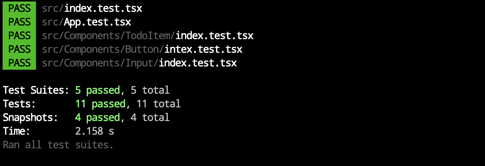
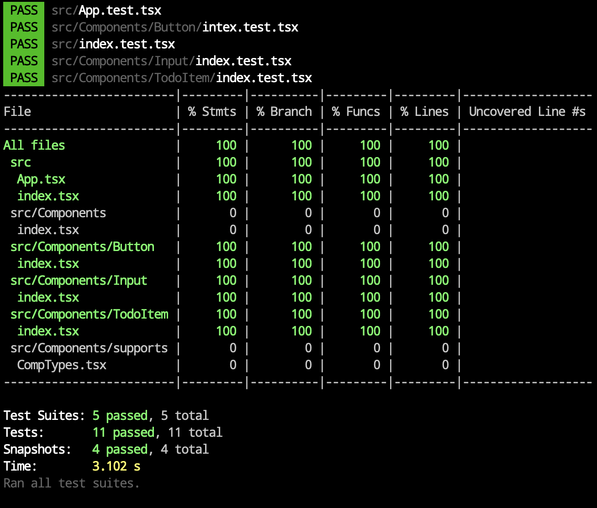

# Hands on :: ToDo List

## How to use

```bash
# Install Dependencies
yarn install
# or | npm install

# Run Unit Test
yarn test
# or | npm run test

# Run Code Coverage Check
yarn test --coverage --watchAll
# or | npm run test -- --coverage --watchAll
```

- Unit Test
  

- Code Coverage
  

<details>
<summary><h2>History</h2></summary>

### Init

```bash
npx create-react-app --template typescript hands-on-todo-list
```

### Dependency

### Typescript Complier: `tsconfig.json`

- To use absolute pakage path in import sytanx, [set 'baseUrl'.](./tsconfig.json#L3)

#### Prettier Hooking

```bash
yarn add --dev husky lint-staged prettier
```

- `.prettierrc.js`: [basic prettier policy](./.prettierrc.js)
- `package.json`: [add husky hook for uing prettier](./package.json#L5-#L14)

#### CSS & Test

```bash
yarn add styled-components
yarn add --dev @types/styled-components jest-styled-components
```

</details>
