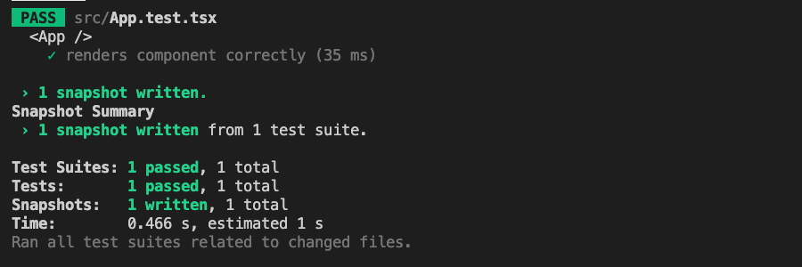
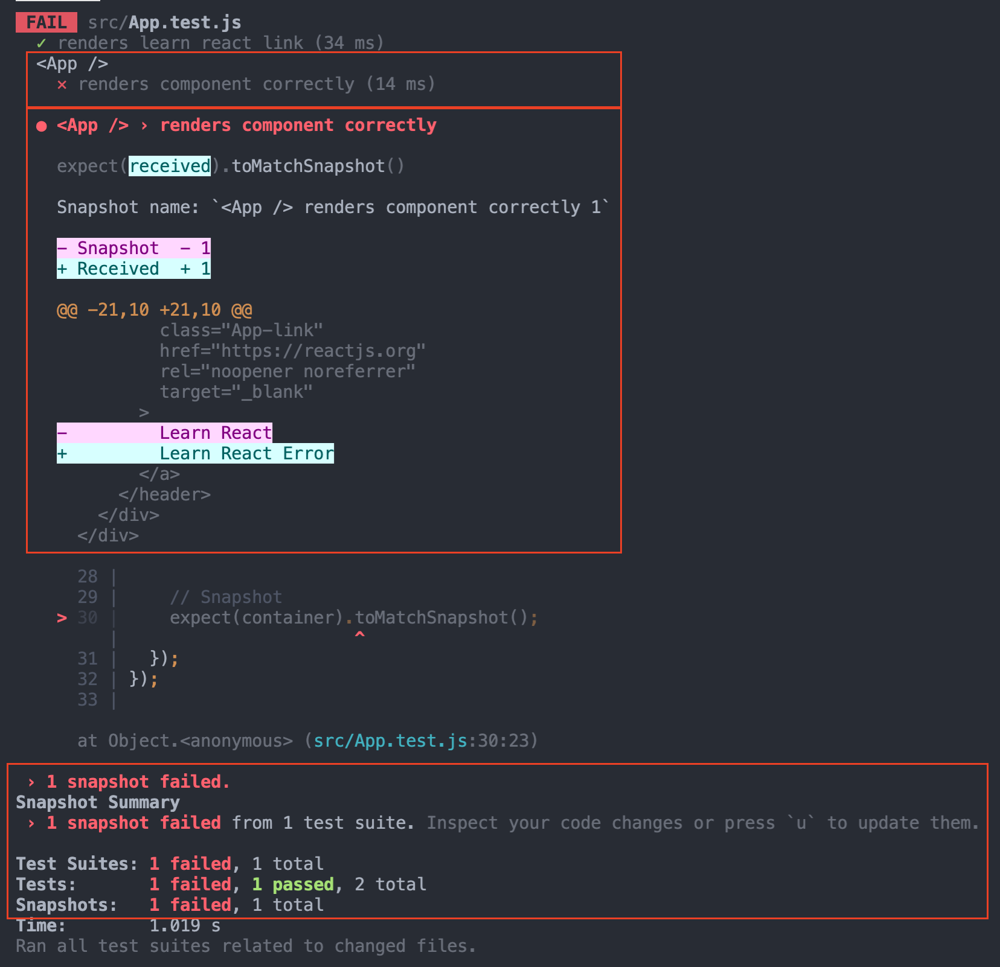

# TDD-React-TS-Porting

Porting typescript from [`tdd-react`](../tdd-react#reademe)

## How to use

```bash
# Install Dependencies
yarn install # or | npm install

# Run Test
yarn test    # or | npm run test
```

- `PASS` result:  
  

- `FAIL` result:  
  

- Check Snapshots in your local directory(**`src/__snapshots__`**).

<details>
<summary>🌟 Recipe</summary>

## Installation dependencies

- Use `yarn` script

  ```bash
  # testing-library for react with typescript
  yarn add --dev \
      typescript \
      @types/node \
      @types/react \
      @types/react-dom \
      @types/jest
  ```

- Use `npm` script

  ```bash
  # testing-library for react with typescript
  npm i --save-dev \
      typescript \
      @types/node \
      @types/react \
      @types/react-dom \
      @types/jest
  ```

## Settings

- [`tsconfig.json`](./tsconfig.json)

<br>
</details>
