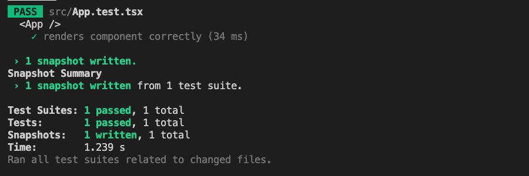
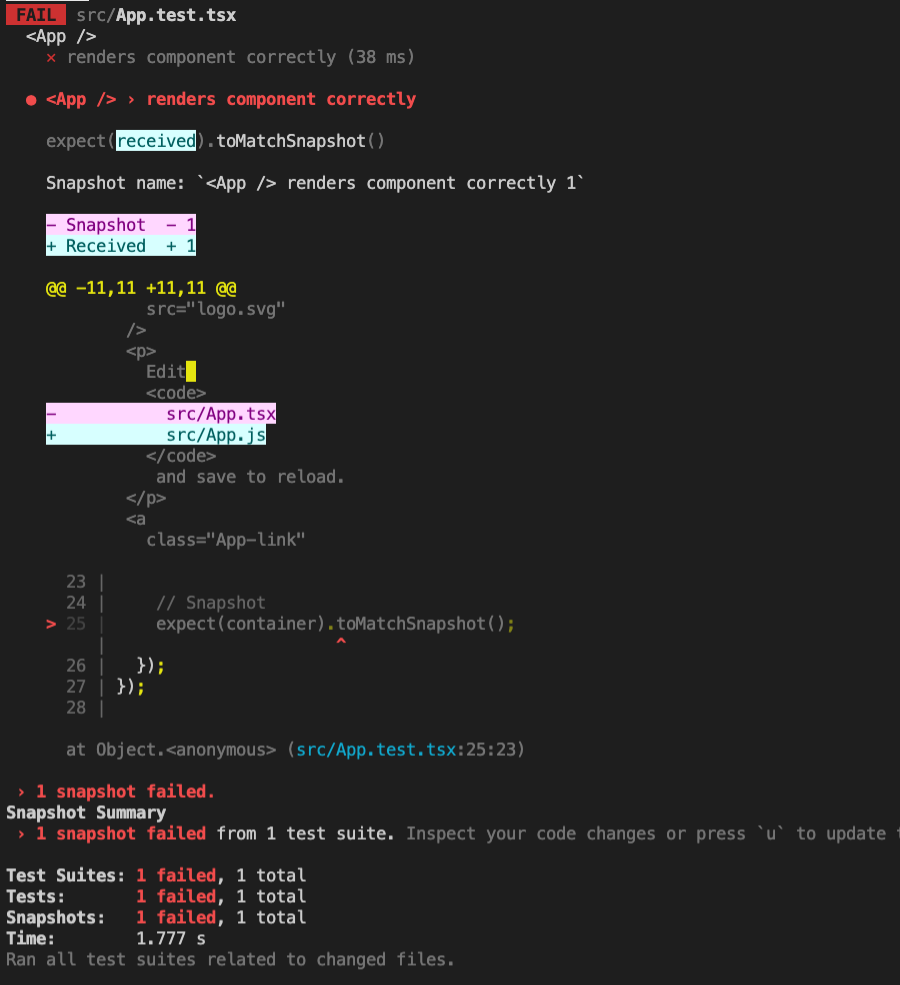

# TDD-React-TS-Porting

Basic react application using `typescript template`

## How to use

```bash
# Install Dependencies
yarn install # or | npm install

# Run Test
yarn test    # or | npm run test
```

- `PASS` result:  
  

- `FAIL` result:  
  

- Check Snapshots in your local directory(**`src/__snapshots__`**).

<details>
<summary>🌟 Recipe</summary>

## Installation dependencies

- Use `yarn` script

  ```bash
  # testing-library for styled-components (on typescript-templated react)
  yarn add \
      styled-components
  
  yarn add --dev \
      @types/styled-components \
      jest-styled-components
  ```

- Use `npm` script

  ```bash
  # testing-library for styled-components (on typescript-templated react)
  npm i --save \
      styled-components
  
  npm i --save-dev \
      @types/styled-components \
      jest-styled-components
  ```

## Settings

- [`tsconfig.json`](./tsconfig.json)

<br>
</details>
