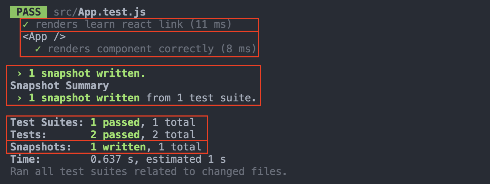
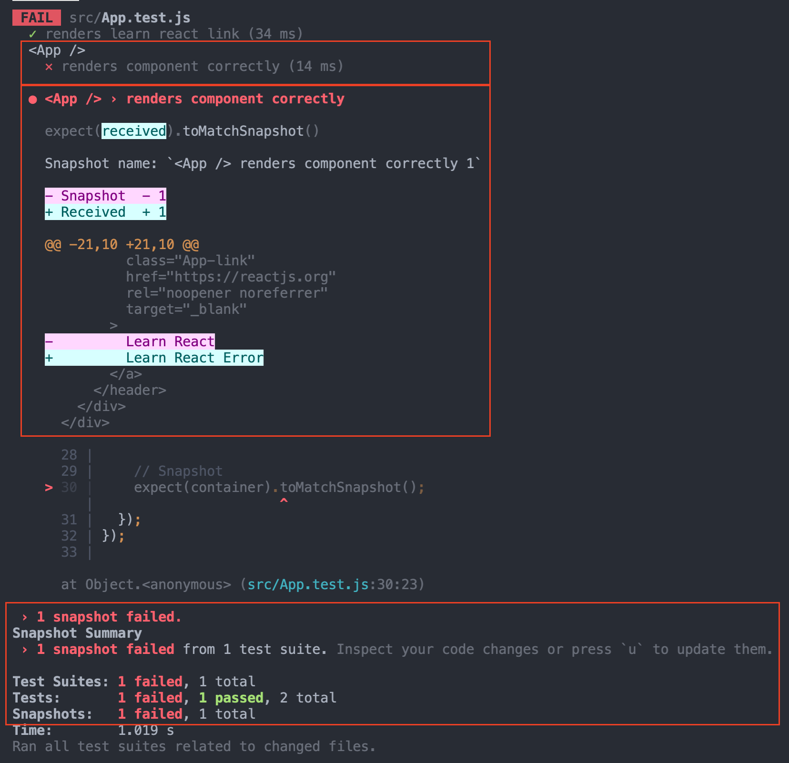

# TDD-React

Basic react application using jest

## How to use

```bash
# Install Dependencies
yarn install # or | npm instal

# Run Test
yarn test    # or | npm run test
```

- `PASS` result:  
  

- `FAIL` result:  
  

- Check Snapshots in your local directory(**`src/__snapshots__`**).

<details>
<summary>🌟 Recipe</summary>

## Installation dependencies

- Use `yarn` script

  ```bash
  # testing-library for react
  yarn add --dev @testing-library/react
  ```

- Use `npm` script

  ```bash
  # testing-library for react
  npm i --save-dev @testing-library/react
  ```

<br>
 </details>
